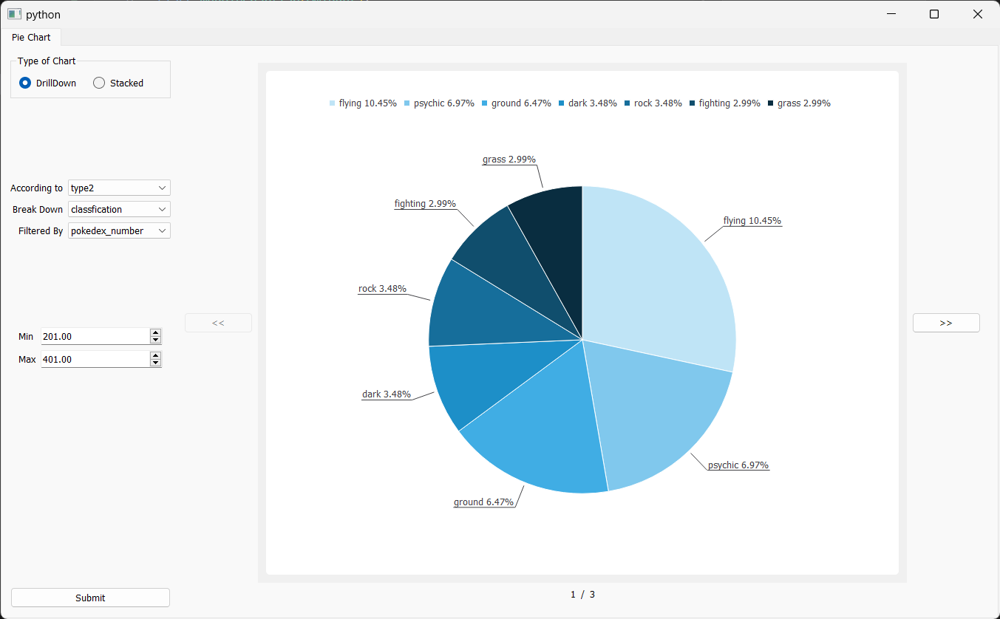
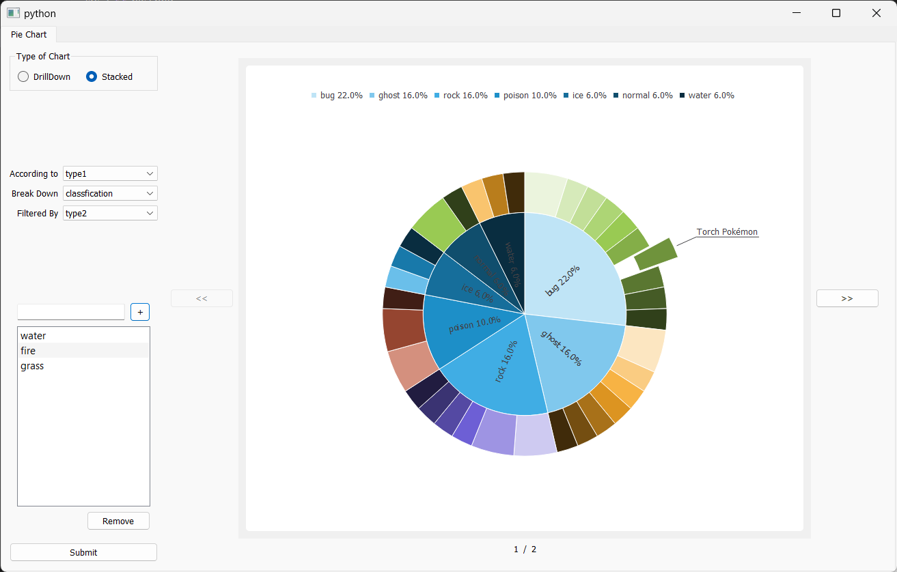

# Pie_Chart
A GUI application that allows users to import various data sets and generate interactive pie charts based on
their input and identfy the categorical columns and allow user to filter data based on any column

Utilized Python for scripting, PyQt5 and Pandas for development and OOP principles for creating modular and
maintainable code.

